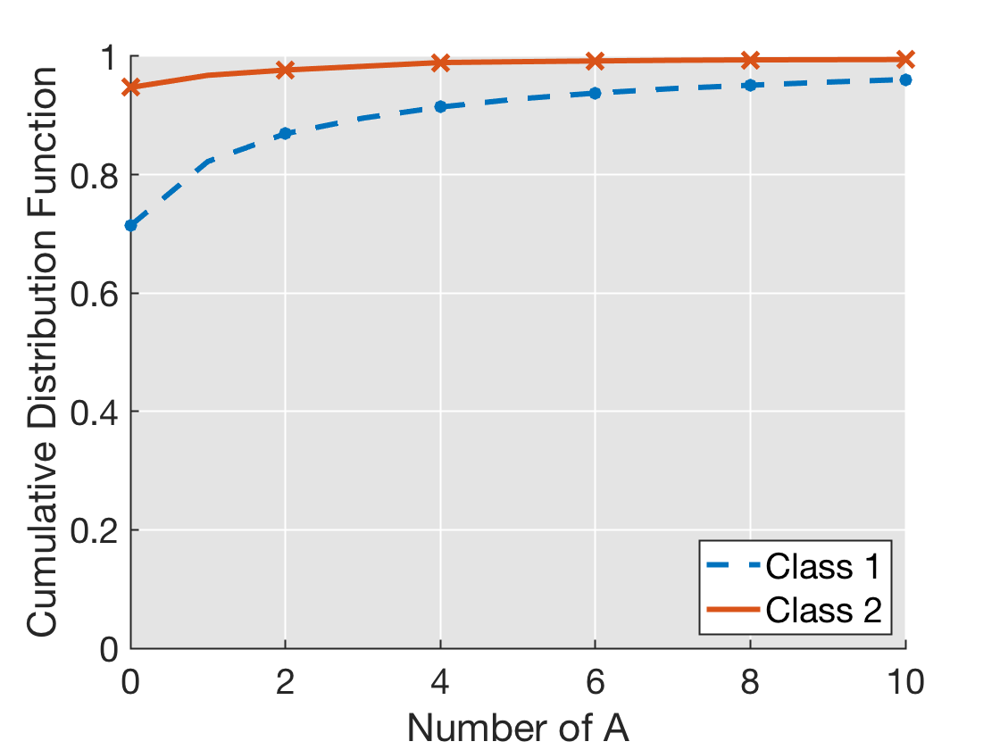
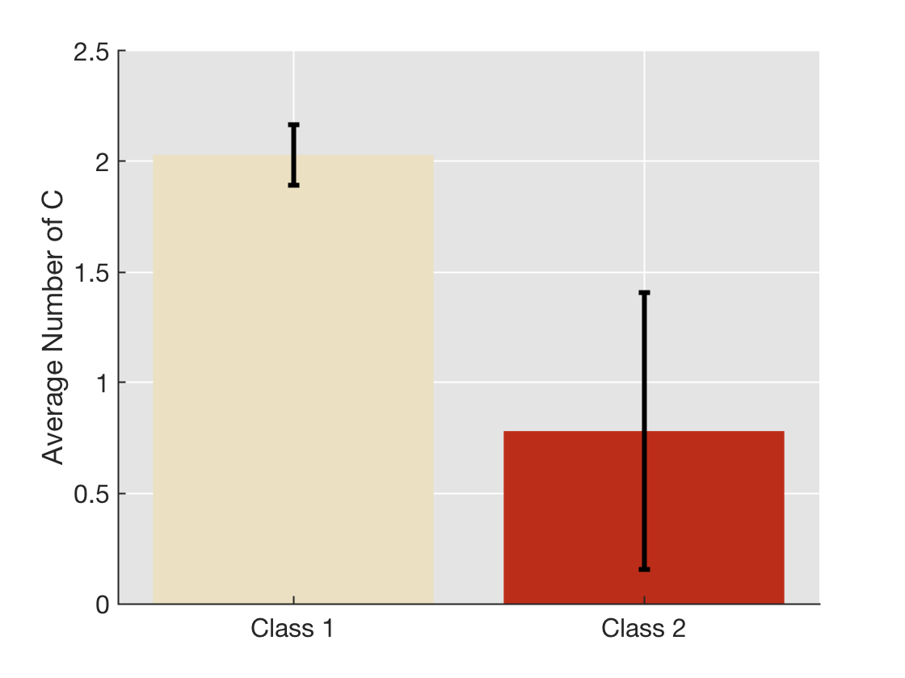
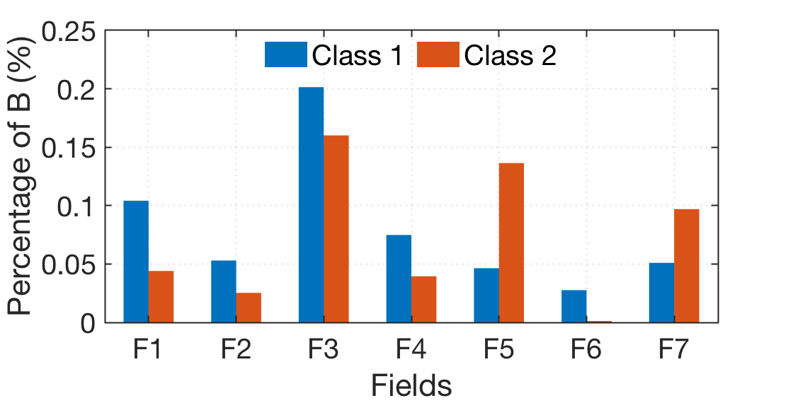
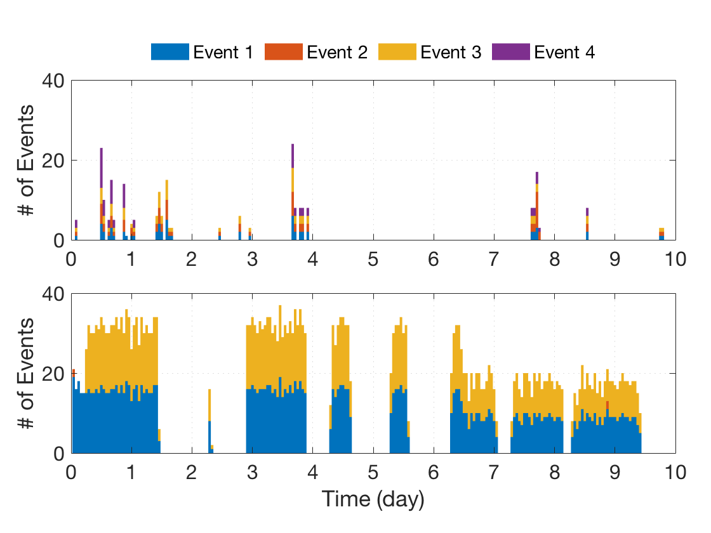
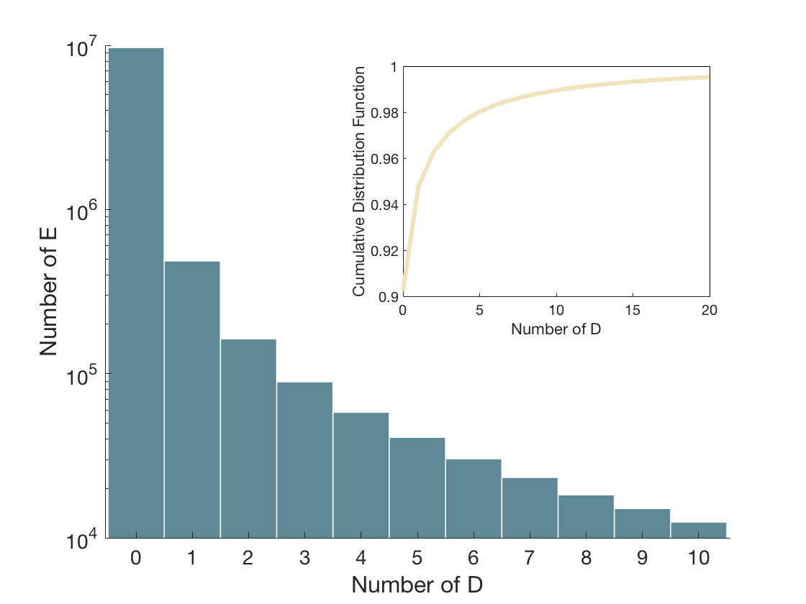
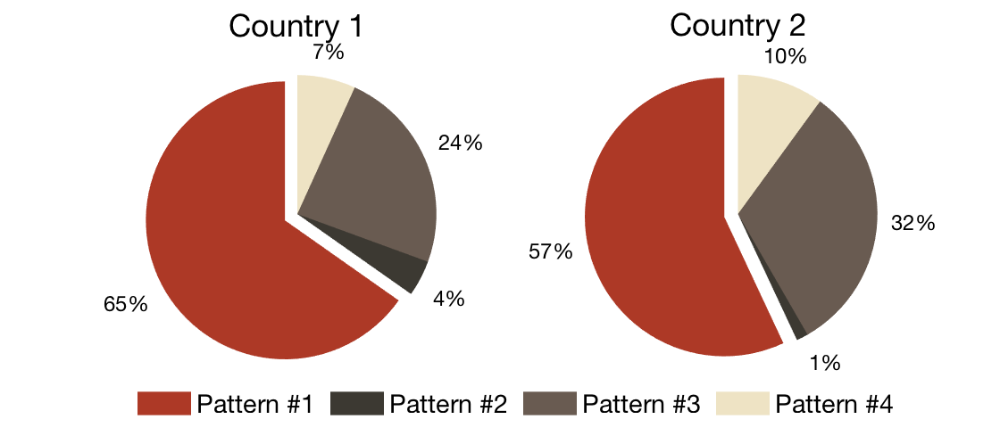
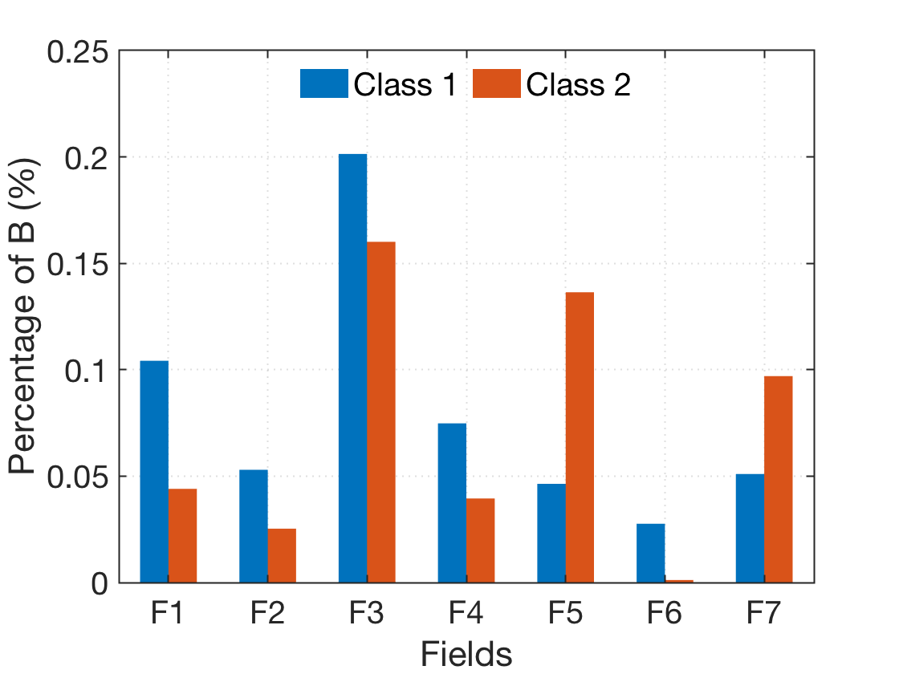
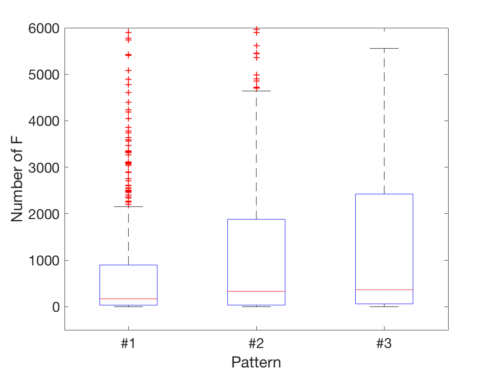

# Acadamic Diagrams
Drawing diagrams for academic papers with Matlab.

## Examples
### Example 1 ~ 3

    
    
    

### Example 4 ~ 6

    
    
    

### Example 7 ~ 9

    
    
    

### Example 10 ~ 11

    
    

